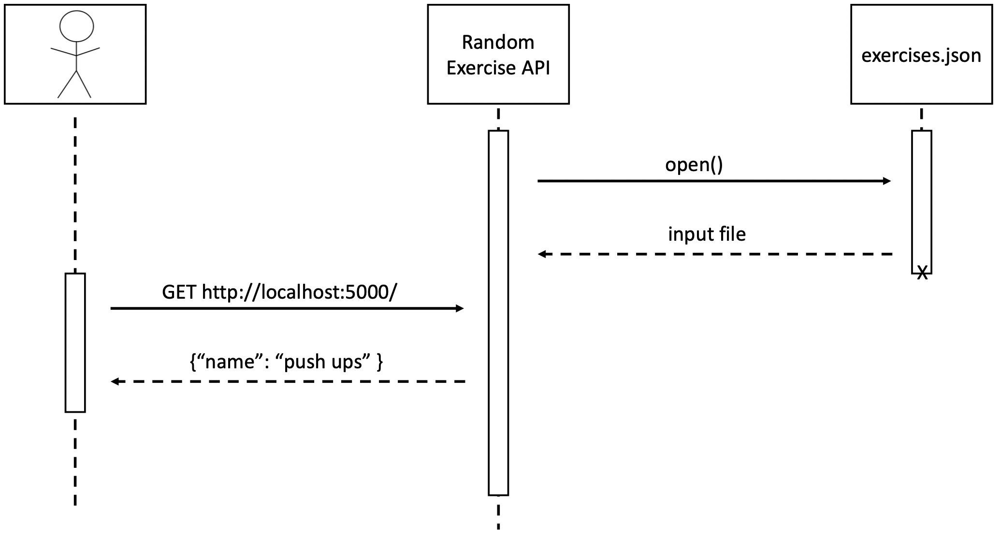

# Random Exercise API

# About
A REST API that returns a JSON containing an exercise randomly chosen from [exercises.json](exercises.json). For example:

```json
{"name": "deadlift"}
```
**UML sequence diagram showing how requesting and receiving data work**


# Instructions 

Note: In all examples, assume the Flask server is running on http://127.0.0.1:5000.

## One-time set-up
1. [Clone the Github repository](https://docs.github.com/en/repositories/creating-and-managing-repositories/cloning-a-repository) to your local environment.
    1. In a terminal, navigate to the directory that contains `random_exercise_api.py`.
1. Create a Python virtual environment. In the examples below, we set up a virtual environment called `.venv`

        python3 -m venv .venv

1. Activate the Python virtual environment.

        source .venv/bin/activate

1. Use `pip` to install the dependencies.

        pip install -r requirements.txt

## Request data

Start the Flask API server.
1. In a terminal, navigate to the directory that contains `random_exercise_api.py`.
1. Activate the Python virtual environment from the [One-time Set-Up](#one-time-set-up) section.
1. In the virtual environment, run the following command to start the server.

    ```sh
    flask --app random_exercise_api.py run
    ```

    <details>
    <summary>Note: Optional Flag(s)</summary>
    - To change the port where the server is running, use the command below:

        ```sh
        flask --app random_exercise_api.py run -p ${PORT_NUMBER}
        ```

        For example, to run the service on Port 3000:

        ```sh
        flask --app random_exercise_api.py run -p 3000
        ```
    </details>

1. In the output of the command, you'll find a link to where the server is running. Example:

    ```sh
    Running on http://127.0.0.1:5000
    ```
    Visit the link to confirm that the server is working. You should see JSON similar to the output below:

    ```json
    {"name": "bicep curls"}
    ```

## Receive data
The server will return JSON containing the exercise. For example,

```json
{"name": "deadlift"}
```

Note: In the examples listed, assume the Flask server is running on `http://127.0.0.1:5000`.

### Method 1: `curl`

From a terminal run this command:
```sh
curl http://127.0.0.1:5000
```

### Method 2: Python
In a Python virtual environment, use the [*requests* module](https://requests.readthedocs.io/en/latest/). Example:

```python
import requests

def call_random_exercise_api(api_url):
    """An example demonstrating how to call the random_exercise_api.py and get a random exercise"

    Args:
        api_url (string): API endpoint for the random_exercise_generator

    Returns:
        json: a key of "name" and a value of the exercise name as a string
    """
    response = requests.get(api_url, timeout=10)
    return response.json()

if __name__ == "__main__":
    # update flask_server_url with site and port where Flask server is running
    FLASK_SERVER_URL = 'http://127.0.0.1:5000'
    API_ENDPOINT = FLASK_SERVER_URL + '/'
    print(call_random_exercise_api(API_ENDPOINT))
```
This will return output similar to 

```json
{"name": "deadlift"}
```
To get only the value of the JSON (a.k.a the name of the exercise as a string), replace `response.json()` with `response.json()["name"]`

This will return output similar to 

```
deadlift
```

# Additional API functionalities

<details>

<summary>Instructions</summary>

## Get all exercises
### Method 1: Using the browser

```
http://localhost:5000/exercises
```

### Method 2: `curl`

```sh
curl http://localhost:5000/exercises
```

## Get an exercise by ID

Replace `${EXERCISE_ID}` with the ID of the exercise. Ex: `1`.

### Method 1: Using the browser

```
http://localhost:5000/exercise/${EXERCISE_ID}
```

Example:

```
http://localhost:5000/exercise/1
```

### Method 2: `curl`

```sh
curl http://localhost:5000/exercise/${EXERCISE_ID}
```

Example:

```
curl http://localhost:5000/exercise/1
```

## Create and add an exercise to the JSON configuration
### Method 1 (recommended): `curl`
1. Ensure the Flask server is running.
1. Open a new terminal. Replace `${NEW_EXERCISE_NAME}` with the name of your new exercise and run the following command:

    ```sh
    curl -X POST -H "Content-Type: application/json" -d '{"exercise":"${NEW_EXERCISE_NAME}"}' http://localhost:5000/exercises
    ```

    Example where we add an exercise called "bench press":
    ```sh
    curl -X POST -H "Content-Type: application/json" -d '{"exercise":"bench press"}' http://localhost:5000/exercises
    ```

    This will return:
    ```json
    {
        "name": "bench press"
    }
    ```

### Method 2: Manual exercises.json file update
1. Navigate to [exercises.json](exercises.json).
1. At the end of the file, add a key of the next numerical index and a value of "name": "name_of_exercise". For example:
    
    ```json
    "100": {
        "name": "upright_row"
    }
    ```
Important: Ensure there are no duplicate keys

## Update an exercise
### Method 1 (recommended): `curl`
1. Ensure the Flask server is running.
1. Open a new terminal. Replace `${EXERCISE_ID}` with the ID of the exercise you'd like to update and `${UPDATED_EXERCISE_NAME}` with the updated exercise name and run the following command:

    ```sh
    curl -X PUT -H "Content-Type: application/json" -d '{"exercise":"${UPDATED_EXERCISE_NAME}"}' http://localhost:5000/exercise/${EXERCISE_ID}
    ```

    Example where we update an exercise of ID 0 with a name called "split squat":
    ```sh
    curl -X PUT -H "Content-Type: application/json" -d '{"exercise":"split squat"}' http://localhost:5000/exercise/0
    ```

    This will return:
    ```json
    {
        "name": "split squat"
    }
    ```

### Method 2: Manual exercises.json file update
1. Navigate to [exercises.json](exercises.json).
1. Identify and update the relevant exercise.

##  Delete an exercise
### Method 1 (recommended): `curl`
1. Ensure the Flask server is running.
1. Open a new terminal. Replace `${EXERCISE_ID}` with the ID of the exercise you'd like to delete.

    ```sh
    curl http://localhost:5000/exercise/${EXERCISE_ID} -X DELETE -v
    ```

    Example where we update an exercise of ID 8:
    ```sh
    curl http://localhost:5000/exercise/8 -X DELETE -v
    ```

### Method 2: Manual exercises.json file update
1. Navigate to [exercises.json](exercises.json).
1. Identify and update the relevant exercise.
</details>